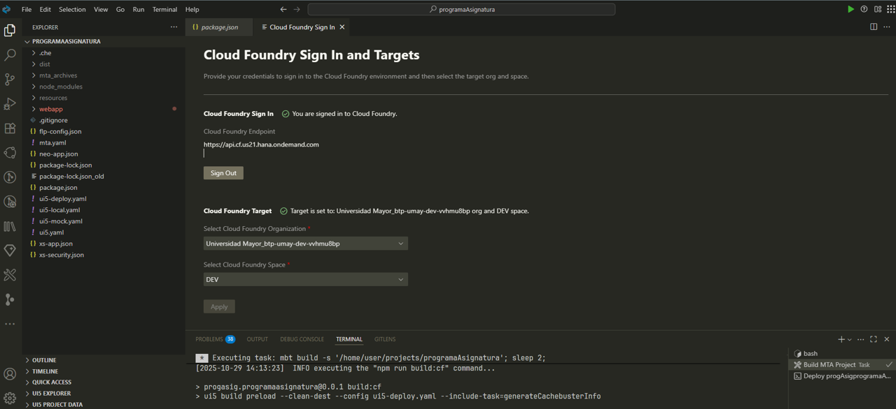

# 🧠 Guía General de Trabajo en SAP Fiori / BAS / Azure DevOps

> ### 🌐 **Landing interactiva → [maxuber79.github.io/guide-bas](https://maxuber79.github.io/guide-bas/)**
> Cheatsheet visual con **copy-to-clipboard**, **búsqueda global (Ctrl+K)**, **lightbox** en capturas, **tema Monokai/Ámbar** y los 7 pasos del flujo clonar → deploy a BTP. Misma info que este README, pero navegable.

## 📚 Índice
- 🚀 [1. Clonar repositorio](#-1-clonar-el-repositorio-desde-azure-devops)
- ⚙️ [2. Instalar dependencias](#-2-instalar-dependencias)
- 💻 [3. Ejecutar aplicación en SAP BAS](#-3-ejecutar-aplicación-en-sap-bas)
- 👤 [4. Modelo de Usuario Global](#-4-modelo-de-usuario-global)
- 🌍 [5. Conexión a Backend SAP](#-5-conexión-a-backend-sap)
- 📦 [6. Build & Deploy MTA](#-6-build--deploy-mta)
- 🔄 [7. Flujo de Pull Request (Azure DevOps)](#-7-flujo-de-pull-request-azure-devops)
- 🪓 [8. Guía Rápida GIT](#-8-guía-rápida-git)
- 🖥️ [9. Landing page (desarrollo local)](#-9-landing-page-desarrollo-local)

---

Aplicación **Planificación de Asignaturas** (SAP UI5 / Fiori) migrada desde SAP Web IDE a **SAP Business Application Studio (BAS)**, con soporte para ejecución local, entorno QAS y despliegue productivo.

  
---

## 🚀 1. Clonar el repositorio desde Azure DevOps
### Nota: Al clonar el repositorio, probablemente pedirá credenciales del repositorio de Azure DevOps.

```text
Username: <tu-usuario-azure-devops>
Password: <tu-personal-access-token>
```

> ⚠️ **Importante:** nunca commitees tu PAT al repo.  
> Genera uno en Azure DevOps → *User settings → Personal access tokens*  
> con permisos de **Code (Read & Write)**. Si ya quedó expuesto, **revócalo** de inmediato.

```bash
git clone [url azure]
```

Ubicarse en la carpeta a nivel de comandos, terminal:
```bash
dir [todas las subcarpetas]
```
```bash
cd [carpeta]
```
Nota: A escribir el comando **cd** más los primeros caracteres del nombre de 
carpeta, se puede precionar [tab] para que complete el nombre de carpeta.

---

## ⚙️ 2. Instalar dependencias

```bash
npm install
```
Opción corta:

```bash
npm i
```

Esto descarga las librerías de UI5 Tooling y Fiori Tools definidas en el `package.json`.

---

## 🧩 3. Archivos clave

| Archivo | Descripción |
|--------|-------------|
| `ui5.yaml` | Configura los middlewares y proxy hacia QAS/PRD. |
| `ui5-local.yaml` | Configuración local con `fiori-tools-proxy` apuntando al backend QA. |
| `package.json` | Scripts de ejecución y build. |
| `Component.js` | Inicialización global de modelos y rutas. |
| `Worklist.controller.js` | Controlador principal de la vista inicial. Incluye simulador de usuario local automático. |

---

## 🧑‍💻 4. Ejecutar la aplicación en BAS (modo local)

Para probar la app directamente (sin Fiori Launchpad), ejecutar:

```bash
npm run start-noflp
```

Levantar la app con Launchpad, ejecutar:

```bash
npm run start-mock
```

Esto corre:

```bash
fiori run --open "index.html?sap-client=300&sap-ui-xx-viewCache=false"
```

La app se abrirá automáticamente en una URL similar a:

```
https://port8080-workspaces-ws-<workspace>.applicationstudio.cloud.sap/index.html
```

### 💡 Notas
- Este modo **no requiere FLP Sandbox** ni autenticación Microsoft.
- Se usa el **simulador de usuario local** automáticamente.
- Ideal para pruebas rápidas y desarrollo dentro de BAS.

---

## 🧍‍♂️ 5. Simulador de usuario local (BAS / localhost)

Cuando ejecutas la app **fuera del Launchpad productivo**, el sistema no tiene login Microsoft ni endpoint `/user-api/attributes`.
Por eso, se activa automáticamente un **mock de usuario** definido en `onInit()`.

```js
const sHost = window.location.host;
const bIsLocalBAS = sHost.includes("applicationstudio.cloud.sap") || sHost.includes("localhost");

if (bIsLocalBAS) {
  // Activa usuario simulado
} else {
  // Usa usuario real Microsoft en producción
}
```

Datos simulados:

```js
{
  "login_name": "rut_usuario_dev",
  "displayName": "Usuario Desarrollo BAS",
  "email": "name@dominio.cl"
}
```

---

## 🌍 6. Conexión a backend SAP QAS

```yaml
server:
  customMiddleware:
    - name: fiori-tools-proxy
      afterMiddleware: compression
      configuration:
        ignoreCertErrors: true
        backend:
          - path: /sap
            url: https://weberpqas.umayor.cl
            client: "300"
```

---

## 📦 7. Construir y desplegar a ABAP (modo clásico)

```bash
npm run build:mta
```

Luego:

```bash
fiori cfDeploy
```

---

## 🧰 8. Comandos útiles de Git

| Acción | Comando |
|--------|---------|
| Ver alias configurados | `git config --get-regexp alias` |
| Crear alias commit | `git config --global alias.cm "commit -m"` |
| Borrar último commit | `git reset --soft HEAD~1` |
| Modificar último commit | `git commit --amend` |
| Ver historial visual | `git log --oneline --graph --all` |

---

## ✅ 9. Checklist rápido

- [x] Repo clonado
- [x] Dependencias instaladas
- [x] Proxy QA configurado
- [x] App ejecutada localmente
- [x] Mock usuario operativo

---

## 🚀 10. Deploy a Cloud Foundry (BTP)


### Autenticarse en "Login to Cloud Foundry"
1. desplegar buscador por medio de los comandos control + p (cuadro de diálogo Quick Open Apertura Rápida).


2. Click en "Login to Cloud Foundry" y llenar lo campos requeridos o realizar click en "Open a new browser page to generate your SSO passcode 


3. Copiar  codigo de autenticación


4. Pegar codigo en "Enter yout SSO Passcode y hacer click en "Sing In"




### 10.2 Compilar proyecto MTA

1. Ubicar `mta.yaml`
2. Clic derecho → **Build MTA Project**

Se generará:

```
mta_archives/com.umayor.sclm.zslcmplanningdoc_0.0.1.mtar
```

### 10.3 Desplegar

1. Abrir carpeta `mta_archives/`
2. Clic derecho → **Deploy MTA Archive**
3. Esperar finalización en terminal

### 10.4 Verificación

```bash
cf apps
cf html5-list
```

Aplicación visible en:

- BTP Cockpit → HTML5 Applications
- Launchpad, si configurado

### 10.5 Troubleshooting

| Error | Causa | Solución |
|------|-------|---------|
| `ERR_OSSL_EVP_UNSUPPORTED` | Node incompatible | Usar Node 18 |
| `No space left on device` | Dev Space lleno | Limpiar / ampliar dev space |
| No aparece en Launchpad | Falta content deploy | Revisar `xs-app.json` |

### 10.6 Automatizar

```bash
mbt build -s . && cf deploy mta_archives/*.mtar
```

### 10.7 Cambiar de ambiente sin volver a hacer login (DEV / QAS / PRD)

En BTP cada subaccount tiene su propia **Organization (CF org)**. Los ambientes de este proyecto son:

| Ambiente | Organization (CF org)                              |
|----------|----------------------------------------------------|
| **QAS**  | `btp-umay-qas-eejalw6c`                            |
| **DEV**  | `Universidad Mayor_btp-umay-dev-vvhmu8bp`          |
| **PRD**  | `Universidad Mayor_btp-umay-prd-5x2o3sqe`          |

> 💡 **Clave:** comparten el mismo CF API endpoint (misma región BTP), por lo que **un único `cf login --sso`** te deja cambiar entre los tres ambientes con `cf target` **sin volver a autenticarte**.

#### 1) Login SSO — una sola vez

```bash
cf login --sso
```

Cloud Foundry abre el navegador, te autenticas con SSO y te lista las orgs disponibles. Selecciona cualquiera.

#### 2) Cambiar de ambiente con `cf target` (sin re-login)

Copiar y pegar directamente — primero seleccionas la **org**, luego listas y eliges el **space**:

```bash
# Apuntar a QAS
cf target -o "btp-umay-qas-eejalw6c"

# Apuntar a DEV
cf target -o "Universidad Mayor_btp-umay-dev-vvhmu8bp"

# Apuntar a PRD
cf target -o "Universidad Mayor_btp-umay-prd-5x2o3sqe"
```

Después de seleccionar la org, lista los spaces disponibles y elige uno:

```bash
cf spaces                      # ver spaces de la org actual
cf target -s <nombre-space>    # apuntar al space (reemplaza <nombre-space>)
```

#### 3) Comandos de inspección

```bash
cf orgs        # lista las organizaciones disponibles
cf spaces      # lista los spaces de la organización actual
cf target      # muestra toda la info del target actual (org, space, user, api)
```

#### 4) Flujo recomendado cuando no recuerdas los nombres

```bash
cf orgs                                  # ver organizaciones
cf target -o "btp-umay-qas-eejalw6c"     # seleccionar una
cf spaces                                # ver sus spaces
cf target -s <nombre-space>              # apuntar al space deseado
```

---

## 🪓 8. Guía Rápida GIT

Documentación base para configurar, iniciar y trabajar con repositorios GIT.  
Incluye comandos esenciales, tips útiles y atajos.

👉 [Visitar repositorio](https://github.com/maxuber79/comand-git?tab=readme-ov-file#%EF%B8%8F-configuraci%C3%B3n-b%C3%A1sica)

## 🖥️ 9. Landing page (desarrollo local)

Este repo incluye una **landing interactiva** (HTML + Bootstrap 5 + SCSS) que renderiza los pasos del flujo con copy-to-clipboard, búsqueda global y lightbox en las capturas.

### 📍 URL publicada
👉 **[maxuber79.github.io/guide-bas](https://maxuber79.github.io/guide-bas/)**  
*(se publica automáticamente con cada push a `main` vía `.github/workflows/deploy.yml`)*

### 🛠 Desarrollo local

```bash
npm install          # instala Bootstrap, Bootstrap-Icons y Sass
npm run build        # copia vendor + compila SCSS → assets/css/styles.min.css
npm run watch:css    # recompila SCSS en cada cambio
```

Luego abre `index.html` con **Live Server** (extensión de VS Code) o sirve la carpeta con cualquier static server.

### 📁 Estructura relevante

```
index.html              # landing principal
scss/                   # fuentes SCSS (tema Monokai/Ámbar)
js/flujo.json           # base de datos de pasos + troubleshooting + galería
js/app.js               # render dinámico, búsqueda, copy, lightbox
scripts/copy-vendor.js  # copia Bootstrap a /assets/vendor
.github/workflows/      # CI/CD → GitHub Pages
img/                    # capturas del flujo de login a Cloud Foundry
```

---

**Desarrollado por:**  
Claudio Muñoz – Universidad Mayor 💙  
SAP Fiori UI5 | Azure DevOps | SAP BAS
